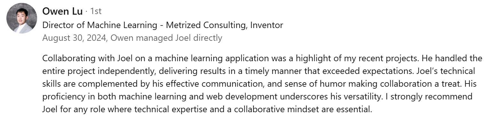
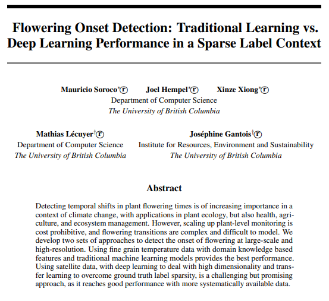

# Hi, I'm Joel Hempel! 👋

**Machine Learning and Full-Stack Developer** based in Vancouver, BC.

- 🎓 **Final-year Computer Science student at UBC** (GPA: **4.2/4.33**)
- 🏆 **ML & SWE Intern** at Metrized Consulting Inc. (09/2023–08/2024), building ML-powered web applications
- 💻 **Undergraduate Research Assistant** at Systopia Lab (05/2023–12/2023), focusing on ML for climate science

---

## ⚡ Highlights

- **Professional Recommendation**: [LinkedIn Recommendation](https://linkedin.com/in/joelhempel#recommendations) from my Director of ML at Metrized Consulting.

- **NeurIPS 2023 Paper**: [“Spring-Onset Detection with Satellite Data”](https://s3.us-east-1.amazonaws.com/climate-change-ai/papers/neurips2023/40/paper.pdf)  
  (I co-authored and presented this paper focused on machine learning for climate research.)

    

---

## 🛠 Technologies & Tools

- **Languages**: Python, Java, C, C++, JavaScript, TypeScript, HTML, CSS  
- **Frameworks & Libraries**: PyTorch, React, Next.js, FastAPI, scikit-learn  
- **Web/Databases**: Supabase, SQL, Tailwind, PHP  
- **Tools**: Git, Docker, AWS, Google Cloud, JUnit, Google Colab  
- **ML Specialties**: Neural Networks, Computer Vision, Language Models  

---

## 🔒 Private Projects

Much of my recent work at **Metrized** and **Systopia Lab** is in private repositories.

- **Interested?** Contact me for a demo or code samples:
  - **Email:** [joelhempel35@gmail.com](mailto:joelhempel35@gmail.com)
  - **LinkedIn:** [linkedin.com/in/joelhempel](https://linkedin.com/in/joelhempel)

I’m happy to discuss details one-on-one, subject to any confidentiality agreements.

---

## 📫 Get in Touch

- **LinkedIn:** [linkedin.com/in/joelhempel](https://linkedin.com/in/joelhempel)
- **GitHub:** [github.com/J0ELh](https://github.com/J0ELh)
- **Email:** [joelhempel35@gmail.com](mailto:joelhempel35@gmail.com)

Feel free to reach out if you’d like to collaborate on projects, discuss research, or learn more about my work!
